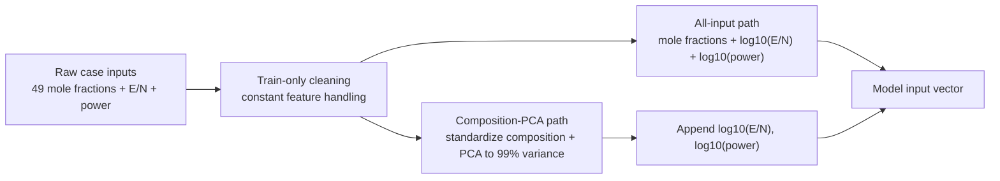
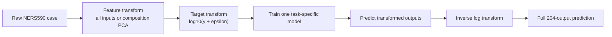
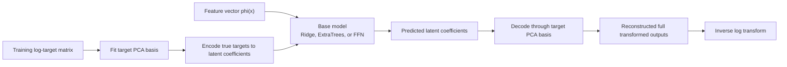
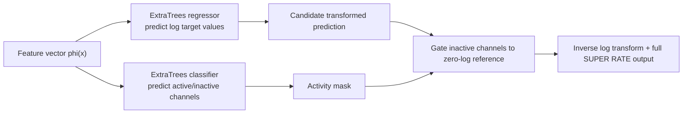
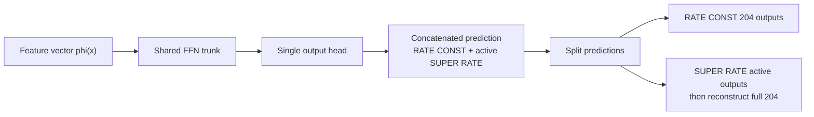
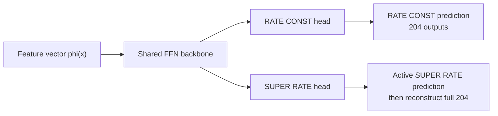

# V03 Model Definitions, Notation, and Pipeline Diagrams

This note defines the model labels used in the V03 figures and reports, and gives formal pipeline diagrams plus mathematical definitions for the model families actually trained in the V03 experiments.

Implementation references:

- Model configs: [`experiment_configs.py`](../../../src/global_kin_ml/experiment_configs.py)
- Separate-task model wrappers: [`models.py`](../../../src/global_kin_ml/models.py)
- Feature preprocessing: [`preprocessing.py`](../../../src/global_kin_ml/preprocessing.py)
- Joint multitask models: [`multitask_pipeline.py`](../../../src/global_kin_ml/multitask_pipeline.py)

## 0. Problem Notation

For each case, the raw inputs are gas composition, reduced electric field, and power:

$$
x_i^{raw}
=
\left[
c_{i,1}, c_{i,2}, \ldots, c_{i,49},
E_i/N_i,
P_i
\right].
$$

The two target families are:

$$
y_i^{rate} \in \mathbb{R}_{\ge 0}^{204},
\qquad
y_i^{super} \in \mathbb{R}_{\ge 0}^{204}.
$$

For SUPER RATE training, constant-zero target channels are dropped before model fitting and reinserted after prediction. In the V03 runs this leaves `m = 94` active SUPER RATE channels:

$$
y_i^{super,active} \in \mathbb{R}_{\ge 0}^{m},
\qquad
m=94.
$$

All models are trained in transformed target space:

$$
t_{i,j}
=
\log_{10}\left(y_{i,j} + \epsilon_j\right),
$$

where the per-output epsilon is estimated from the training split only:

$$
\epsilon_j
=
\max
\left(
\frac{\min_{i: y_{i,j} > 0} y_{i,j}}{10},
10^{-30}
\right).
$$

Predictions are converted back to original units by:

$$
\hat{y}_{i,j}
=
\max
\left(
10^{\hat{t}_{i,j}} - \epsilon_j,
0
\right).
$$

## 1. Input Feature Pipelines

The physical scalar inputs are log-transformed:

$$
\tilde{E}_i
=
\log_{10}(E_i/N_i),
\qquad
\tilde{P}_i
=
\log_{10}(P_i).
$$

Two feature representations are used in the V03 comparisons.

### 1.1 All-Input Feature Set

This feature set keeps mole fractions directly and appends the log-transformed physical controls:

$$
\phi_{\text{all}}(x_i)
=
\left[
c_{i,1}, \ldots, c_{i,49},
\tilde{E}_i,
\tilde{P}_i
\right].
$$

In code and result CSVs this is named:

`all_inputs_plus_log_en_log_power`

### 1.2 Composition-PCA Feature Set

This feature set first removes composition features that are constant in the training split, standardizes the remaining composition variables, applies PCA to the composition block, then appends the log-transformed E/N and power controls.

Training-only standardization:

$$
z_i^{comp}
=
\frac{c_i^{nonconstant} - \mu_{comp,train}}
{\sigma_{comp,train}}.
$$

PCA projection:

$$
p_i
=
U_k^\top z_i^{comp}.
$$

The number of input PCA components is not manually set to 1-20. It is selected as the smallest component count `k` whose cumulative training explained variance reaches 99%:

$$
k
=
\min
\left\{
r:
\sum_{\ell=1}^{r} \lambda_\ell
\ge
0.99
\right\}.
$$

The final feature vector is:

$$
\phi_{\text{pca}}(x_i)
=
\left[
p_i,
\tilde{E}_i,
\tilde{P}_i
\right].
$$

In code and result CSVs this is named:

`composition_pca_plus_log_en_log_power`

### 1.3 Input Pipeline Diagram

## 2. Model Label Dictionary

The compact labels in V03 result figures mean:

| Label | Meaning |
|---|---|
| `ST` | Separate-task model. RATE CONST and SUPER RATE are trained as separate prediction problems. |
| `D` | Direct-output model. The model predicts transformed target values directly. |
| `L` | Latent-output model. Target PCA coefficients are predicted, then decoded back to outputs. |
| `ET` | ExtraTrees ensemble regressor. |
| `FFN` | Feed-forward neural network, also called MLP in the code. |
| `Ridge` | Ridge regression baseline. |
| `Joint-FFN (1H)` | Joint single-head FFN. One network predicts RATE CONST and SUPER RATE together. |
| `Joint-FFN (2H)` | Shared-backbone, two-head FFN. One shared trunk with separate RATE CONST and SUPER RATE heads. |

## 3. Separate-Task Direct Models

Separate-task direct models train one model family for one target group at a time:

$$
\hat{T}^{rate}
=
f_{\theta}^{rate}(\phi(x)),
$$

or:

$$
\hat{T}^{super,active}
=
f_{\theta}^{super}(\phi(x)).
$$

Here `T` denotes log-transformed targets. For SUPER RATE, the model predicts only active nonconstant channels, then reconstructs the full 204-vector by reinserting dropped constant-zero channels.

### 3.1 Direct Separate-Task Pipeline

### 3.2 Ridge Baseline

Ridge is the linear baseline. It uses standardized model inputs and solves a regularized least-squares problem:

$$
\hat{W}, \hat{b}
=
\arg\min_{W,b}
\left[
\sum_{i=1}^{n}
\left\|
T_i - W^\top \phi(x_i) - b
\right\|_2^2
+
\alpha \|W\|_2^2
\right].
$$

V03 curated hyperparameter:

$$
\alpha = 10.
$$

Interpretation: Ridge tests how much of the target structure can be explained by a mostly linear relationship between transformed inputs and transformed outputs. In V03, Ridge is mainly a sanity-check baseline and is much weaker than nonlinear models.

### 3.3 ExtraTrees

ExtraTrees is an ensemble of randomized decision trees. Each tree partitions feature space using randomized split candidates and predicts a vector-valued target. The ensemble prediction is the average over `B` trees:

$$
\hat{T}_i
=
\frac{1}{B}
\sum_{b=1}^{B}
h_b(\phi(x_i)).
$$

V03 curated hyperparameters:

$$
B=200,
\qquad
\text{max depth}=12,
\qquad
\text{min samples per leaf}=1.
$$

Interpretation: ExtraTrees is well suited for this dataset because the relationship between composition, E/N, power, and reaction rates is nonlinear and piecewise structured. It can represent threshold-like activation regimes without requiring gradient-based neural optimization.

### 3.4 Feed-Forward Network / MLP / FFN

In this project, `FFN` and `MLP` refer to the same model family: a fully connected feed-forward neural network.

For hidden layers indexed by `ell = 1,...,L`:

$$
h_0
=
\operatorname{standardize}(\phi(x)),
$$

$$
h_\ell
=
\operatorname{ReLU}
\left(
W_\ell h_{\ell-1} + b_\ell
\right),
$$

and the output layer predicts standardized transformed targets:

$$
\hat{s}
=
W_{out} h_L + b_{out}.
$$

The output is then inverse-standardized back to transformed log-target space:

$$
\hat{T}
=
\hat{s} \odot \sigma_{T,train} + \mu_{T,train}.
$$

V03 curated hyperparameters:

$$
L=3,
\qquad
\text{hidden width}=256,
\qquad
\text{dropout}=0,
\qquad
\text{weight decay}=10^{-5}.
$$

For joint FFNs, the optimizer settings are:

$$
\text{learning rate}=10^{-3},
\qquad
\text{batch size}=256,
\qquad
\text{max epochs}=120,
\qquad
\text{patience}=15.
$$

Interpretation: FFNs are flexible smooth nonlinear models. They are scientifically useful baselines, but in V03 they generally did not beat ExtraTrees, likely because tree ensembles better capture sharp tabular regime changes with less tuning.

## 4. Separate-Task Latent-Output PCA Models

Latent-output models compress the target matrix, predict PCA coefficients, then decode back to the original output dimension.

First, PCA is fit on the training transformed target matrix `T_train`:

$$
T_i
\approx
\mu_T
+
V_k a_i,
$$

where `V_k` contains the first `k` target-PCA directions and `a_i` is the latent coefficient vector:

$$
a_i
=
V_k^\top
\left(
T_i - \mu_T
\right).
$$

The supervised model predicts latent coefficients:

$$
\hat{a}_i
=
g_\theta(\phi(x_i)).
$$

The final transformed output prediction is reconstructed as:

$$
\hat{T}_i
=
\mu_T
+
V_k \hat{a}_i.
$$

V03 curated latent dimension:

$$
k=8.
$$

### 4.1 Latent-Output Pipeline

Interpretation: latent-output PCA tests whether the 204 outputs can be represented by a lower-dimensional target manifold. It can reduce target dimension, but it can also remove reaction-specific detail. Therefore model ranking is based on reconstructed 204-output metrics, not latent-space loss alone.

## 5. Two-Stage Sparse ExtraTrees for SUPER RATE

The two-stage sparse model was tested for SUPER RATE because many SUPER RATE channels are exactly zero or near structurally inactive in parts of the dataset.

For each output channel `j`, define the training-space zero-log reference:

$$
z_j
=
\min_i T_{i,j}.
$$

Define an activity label:

$$
a_{i,j}
=
\mathbb{1}
\left[
T_{i,j} > z_j + 10^{-12}
\right].
$$

The two-stage model trains:

$$
\hat{T}_i
=
r_\theta(\phi(x_i)),
$$

and, for variable-activity channels:

$$
\hat{a}_{i,j}
=
c_\psi(\phi(x_i))_j.
$$

The final transformed prediction gates inactive channels back to their zero-log value:

$$
\hat{T}_{i,j}^{final}
=
\begin{cases}
\hat{T}_{i,j}, & \hat{a}_{i,j}=1, \\
z_j, & \hat{a}_{i,j}=0.
\end{cases}
$$

### 5.1 Two-Stage Sparse Pipeline

Interpretation: this model explicitly separates "is this channel active?" from "what is the value if active?" It is useful for sparse outputs, although in the V03 condensed leaderboard the strongest SUPER RATE baseline remained direct ExtraTrees.

## 6. Joint Multitask FFN Models

Joint models predict RATE CONST and active SUPER RATE together from the same input features. They are motivated by the physics: both target families are generated from the same electron energy distribution but through different coefficient maps.

The joint validation score balances the two tasks:

$$
\operatorname{score}_{joint}
=
0.5 \cdot \operatorname{RMSE}_{log}^{rate}
+
0.5 \cdot \operatorname{RMSE}_{log}^{super,active}.
$$

### 6.1 Joint Single-Head FFN

The single-head model concatenates the two target groups and trains one FFN output layer:

$$
z_i
=
f_\theta(\phi(x_i)),
$$

$$
\left[
\hat{T}_i^{rate},
\hat{T}_i^{super,active}
\right]
=
W z_i + b.
$$

Pipeline:

Interpretation: this model forces both target families to share the same hidden representation and the same final output mapping style. It is the simplest multitask neural baseline.

### 6.2 Shared-Backbone Two-Head FFN

The two-head model uses one shared hidden trunk but separate output heads:

$$
z_i
=
f_\theta(\phi(x_i)),
$$

$$
\hat{T}_i^{rate}
=
W_{rate} z_i + b_{rate},
$$

$$
\hat{T}_i^{super,active}
=
W_{super} z_i + b_{super}.
$$

Its training loss is:

$$
\mathcal{L}
=
0.5 \cdot
\operatorname{MSE}
\left(
\hat{S}^{rate},
S^{rate}
\right)
+
0.5 \cdot
\operatorname{MSE}
\left(
\hat{S}^{super},
S^{super}
\right),
$$

where `S` denotes standardized transformed targets inside neural-network training.

Pipeline:

Interpretation: this architecture is more physically motivated than the single-head model because it lets RATE CONST and SUPER RATE share a learned representation while still using task-specific output maps.

## 7. Condensed Leaderboard Feature-Set Mapping

The condensed figures hide long model keys, so the feature-set choices are summarized here:

| Condensed label | Input PCA usage in condensed leaderboard |
|---|---|
| `ST-D-ET` | RATE CONST uses `composition_pca_plus_log_en_log_power`; SUPER RATE uses `all_inputs_plus_log_en_log_power`. |
| `ST-D-FFN` | Uses `all_inputs_plus_log_en_log_power`. |
| `ST-L-ET` | Uses `composition_pca_plus_log_en_log_power`. |
| `ST-L-FFN` | Uses `composition_pca_plus_log_en_log_power`. |
| `ST-D-Ridge` | Uses `full_nonconstant_plus_log_en_log_power`. |
| `ST-L-Ridge` | Uses `composition_pca_plus_log_en_log_power` where shown. |
| `Joint-FFN (1H)` | Uses `all_inputs_plus_log_en_log_power`. |
| `Joint-FFN (2H)` | Random-case condensed chart uses `composition_pca_plus_log_en_log_power`; 10mJ holdout condensed chart uses `all_inputs_plus_log_en_log_power`. |

Source table:

[`comparison_no_random_forest_task_specific_validation.csv`](../../../results/ners590_v03_joint_review/comparison_no_random_forest_task_specific_validation.csv)

## 8. Practical Interpretation

The V03 experiments compare three modeling ideas:

- Linear baseline: Ridge tests whether the mapping is approximately linear after log transforms.
- Nonlinear tabular baseline: ExtraTrees tests piecewise nonlinear structure and is the strongest current baseline.
- Neural baseline: FFN tests learned smooth nonlinear representations, including joint RATE CONST + SUPER RATE sharing.
- Latent-output baseline: target PCA tests whether the 204-output target vector can be predicted through a lower-dimensional representation.
- Sparse-output baseline: two-stage ExtraTrees tests whether SUPER RATE benefits from explicit active/inactive gating.

The strongest current practical conclusion is that separate-task ExtraTrees models remain the most reliable V03 baselines, while joint FFN models are useful research baselines for testing whether shared physical structure can be exploited more directly in future architectures.
